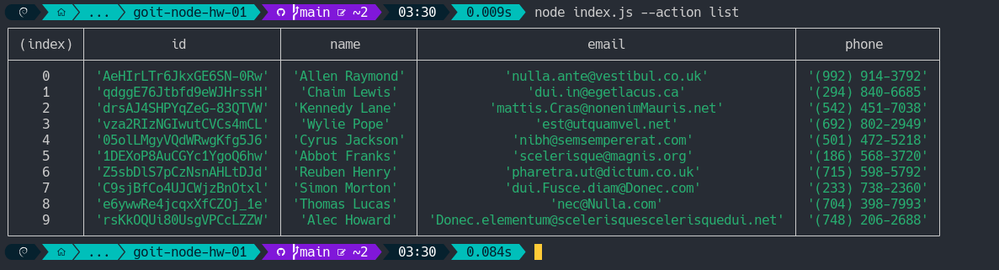
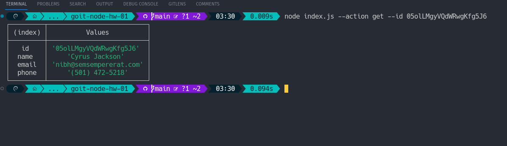
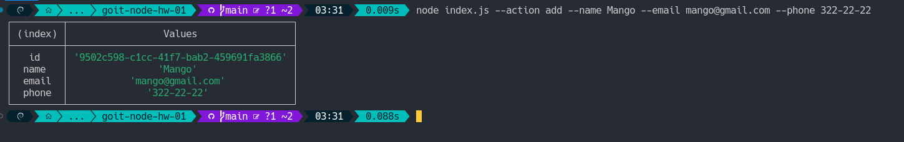
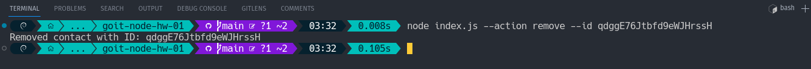

**Step 1**

- Initialize npm in the project [`npm init`]
- In the root of the project, create a file `index.js`
- Install package nodemon as development dependency (devDependencies) [`npm i nodemon --save-dev`]
- In `package.json` file add `"scripts"` to run `index.js`
- - `start` script that starts `index.js` with `node`
- - `start:dev` script that starts `index.js` with `nodemon`
    <code>
    //package.json
    ...
    "scripts": {
    "start": "node index.js",
    "start:dev": "nodemon index.js"
    }
    ...
    </code>

**Step 2**

- Create a folder `db` in the root of the project. To store contacts, download and use the `contacts.json` file, putting it in the `db` folder.

- At the root of the project, create a `contacts.js` file.

- Make imports of modules `fs` and `path` to work with the file system
- Create a `contactsPath` variable and put the path to the `contacts.json` file in it. To compose a path, use the methods of the `path` module
- Add functions to work with a collection of contacts. In functions, use the `fs` module and its `readFile()` and `writeFile()` methods
  Make export of created functions via `module.exports`

**Step 3**

- Make an import of the `contacts.js` module in the `index.js` file and check the functionality of the functions for working with contacts.

**Step 4**

- The `index.js` file imports the `yargs` package for convenient parsing of command line arguments.
- Use the ready-made function `invokeAction()` which receives the type of action to be performed and the required arguments.
- The function calls the appropriate method from the `contacts.js` file, passing it the necessary arguments.

**Step 5**
Run the commands in the terminal and take a separate screenshot of the result of each command.

- `node index.js --action list`
- `node index.js --action get --id 05olLMgyVQdWRwgKfg5J6`
- `node index.js --action add --name Mango --email mango@gmail.com --phone 322-22-22`
- `node index.js --action remove --id qdggE76Jtbfd9eWJHrssH`

**LIST**

**GET**

**ADD**

**Remove**

